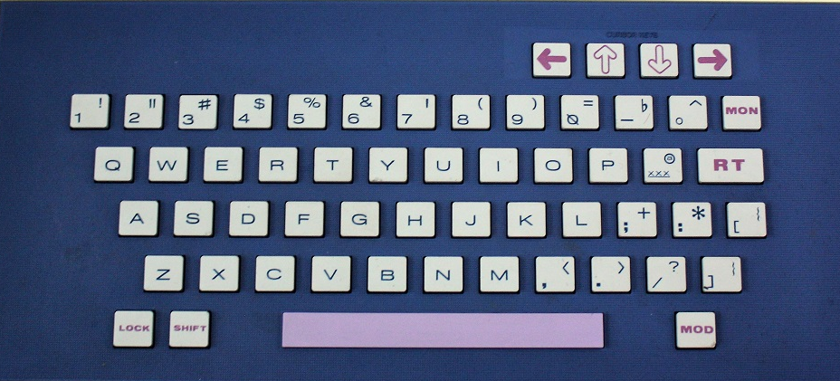
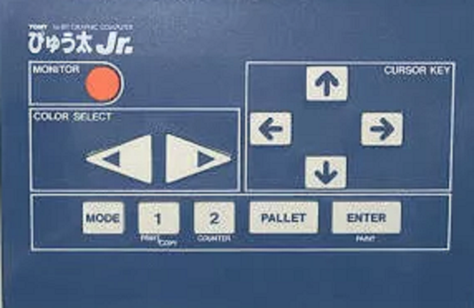

    

# [Tomy Tutor](https://wikipedia.org/wiki/Tomy_Tutor) for [MiSTer](https://mister-devel.github.io/MkDocs_MiSTer/)
This is an FPGA implementation of the Tomy Tutor, Pyuta, and Pyuta Jr. for the MiSTer FPGA platform.

## Features
- Support for Tutor, Pyuta and Pyuta Jr
- Tape-In support via [ADC](https://mister-devel.github.io/MkDocs_MiSTer/basics/addons/#adc-analog-audio-input-addon-board)
- Tape support via tape images.  (Read and Write)
- Matthew Hagerty's F18A - With selectable 4/32 sprite limit.

## Required Files - Not Included
System Roms can be obtained from Mame and you can use any .rom filename you want that helps you identify each system.
- For Tutor, from tutor.zip, combine both bin files, tutor1.bin and tutor2.bin into one.
    - (Win/DOS) `copy /b tutor1.bin + /b tutor2.bin Tutor.rom`
    - (Linux/MiSTer) `cat tutor1.bin tutor2.bin > Tutor.rom`
- For Pyuta, from pyuuta.zip, rename tomy29.7 to something like Pyuta.rom
- For PyutaJr, from pyuutajr.zip, either keep the name of ipl.rom or rename it to something like PyutaJr.rom

## Joystick
- Support for two 2-button controllers.
- Most, if not all, games will prompt you for Ama(ture) or Pro difficulty, press :
    - SL = Joystick Button 1 for Amature
    - SR = Joystick Button 2 for Pro

## Keyboard Mapping
The Keyboard layout follows the physical layout of the Tutor and the Pyuta with exception of following keys:
PC | Tomy
-- | ----
<kbd>F1</kbd> | <kbd>MON</kbd>
<kbd>F2</kbd> | <kbd>MOD</kbd>
<kbd>]</kbd> | <kbd>[</kbd> key on Tutor
<kbd>\</kbd> | <kbd>]</kbd> key on Tutor
<kbd>Backspace</kbd> | Cursor Left
<kbd>P</kbd> | Pallet (Jr only)
<kbd>,</kbd> | Color Select Left (Jr Only)
<kbd>.</kbd> | Color Select Right (Jr Only)
- All other keys follow physical layout of Tutor Keyboard.  See layouts below for each system

## Hotkeys
- F5 Stop Tape    - In rare chance the tape doesn't stop after a Load/Save is complete
- F6 Rewind Tape  - Rewinds tape image to the beginning.

## Tape Support
- Tape in Support via ADC
- Save/Load to tape files (.cas)
    - Create blank files to use from 1K and up.  1K tape file is good enough for a couple of lines of basic, I suggest you start at 3-4K.  Larger if you want to have multiple saves on one "tape"
        * (Linux/MiSTer) `dd if=/dev/zero of=MyBlankTape.cas count=NUMBER_OF_512_BYTE_BLOCKS`    (ex. for a 3K file: count=6)
    - With Tape files, Reading, Writing and Stopping is automatic.  In the rare event something goes wrong and it doesn't automatically stop, you can Press the F5 key or select Stop from Tape Menu.
    - If enabled, the Tape Status Bar will appear in the top left corner of the screen indicating how many 1K blocks the file is and which block is being currently read/written to/from.  It will also display current tape activity (Play,Record, Stopped...) and if the tape image is write protected.  Green Lock indicates the image is Write Protected, Red Lock and text indicate write protection is OFF.
    - Once you have finished writting to a tape image and you want to protect it.  I suggest you unmount the file image and when you get the chance from MiSTer's Terminal, change the file permissions to remove the Write Permission
        * (Linux/MiSTer) `chmod -w MyPreciousTape.cas`

## Known Issues
- Can't load from tape in Graphic/GBasic mode.

## Special Credits and Thanks
- TMOP for his help with testing and gathering carts to test.
- [Original TMS99095 FPGA code by Paul Ruiz](https://gitlab.com/pnru/cortex/-/blob/master/tms99095.v).
- [F18A VDP by Matthew Hagerty](https://dnotq.io/f18a/f18a.html).

